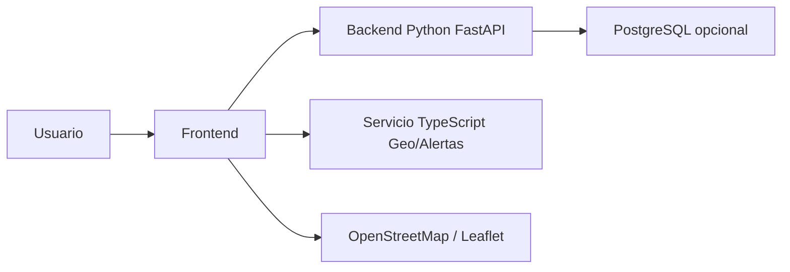

# Entrega 2 - Avance del proyecto

## I. Datos generales del proyecto

**Título:** Sistema Inteligente de Recolección de Residuos Sólidos Segregados para la Gestión Ambiental Urbana en la ciudad del Cusco.

**Objetivo general:** Desarrollar un sistema web que optimice la recolección de residuos, mejore la comunicación ciudadana y apoye la toma de decisiones municipales.

**Objetivos específicos:**

- Implementar registro e inicio de sesión según rol.
- Consultar horarios de recolección por zona.
- Permitir el reporte y seguimiento de incidencias ciudadanas.
- Visualizar rutas, camiones y alertas operativas.
- Brindar herramientas de administración para zonas, horarios, camiones y mantenimiento.

**Alcance:** MVP funcional con frontend React/TypeScript, backend FastAPI en Python, servicio auxiliar TypeScript y soporte opcional PostgreSQL. Cubre procesos de ciudadano, operador y administrador mediante API REST.

**Tecnologías:** React, TypeScript, Vite, Python, FastAPI, PostgreSQL, OpenStreetMap, Leaflet, JWT, bcrypt.

**Usuarios objetivo:** Ciudadanos, operadores municipales, administradores y conductores.

## II. Arquitectura

El sistema usa una arquitectura cliente-servidor distribuida:

- **Frontend** (`frontend/`): SPA React con autenticación, paneles operativos y administración.
- **Backend principal** (`backend-python/`): API REST con FastAPI, autenticación, CRUD y monitoreo.
- **Servicio Geo/Alertas** (`backend-typescript/`): API auxiliar para alertas y datos de geolocalización.
- **Base de datos** (`database/`): scripts de esquema y datos iniciales para PostgreSQL.

## III. Metodología aplicada

### Product Backlog priorizado

| Prioridad | Historia | Impacto |
| --- | --- | --- |
| Alta | Registro e inicio de sesión | Autenticación segura |
| Alta | Consulta de horarios | Mejor servicio ciudadano |
| Alta | Reporte y seguimiento de incidencias | Respuesta municipal eficiente |
| Alta | CRUD administrativo | Gestión operativa centralizada |
| Media | Monitor de rutas y alertas | Apoyo a despacho operativo |
| Media | Priorización de zonas | Mejora de la toma de decisiones |
| Media | Recuperación de contraseña | Seguridad y resiliencia |
| Baja | PostgreSQL local y despliegue | Escalabilidad y persistencia |

### Sprints

- **Sprint 1:** Base de autenticación, navegación y consulta ciudadana.
- **Sprint 2:** Reportes, administración, rutas, alertas y métricas.

## IV. Resultados funcionales

- Registro e inicio de sesión con rol.
- CRUD de zonas, horarios, camiones y mantenimiento.
- Administración de usuarios con cambio de roles.
- Reportes ciudadanos y resolución de incidencias desde la vista de reportes para operadores y administradores.
- Exportación de reportes y métricas a CSV desde la interfaz para facilitar la entrega de información.
- Monitor operativo con alertas y sugerencias de despacho.
- Mapa con rutas y posiciones de camiones.
- Filtros de estado y búsqueda por conductor en el panel administrativo.
- Recuperación de contraseña con token persistente.
 - Registro de recolecciones por conductor y confirmación de recolección por ciudadano (endpoints y formularios asociados).

## V. Validación y pruebas

- Backend validado con `pytest -q` (`16 passed`).
- Frontend validado con `Vitest` (`11 passed`) y pruebas end-to-end.
- Pruebas de integración real del frontend contra FastAPI.
- Build de frontend verificado localmente con `npm run build`.
- Implementada la vista “Mis reportes” para usuarios ciudadanos, mostrando solo sus propios reportes.
- Resultados de prueba locales: `npx vitest run` con `11 passed`.

## VI. Seguridad y accesibilidad

- JWT para validación de sesiones.
- Roles protegidos por endpoint (`admin`, `operador`, `conductor`, `ciudadano`).
- Recuperación de contraseña segura.
- Interfaz responsive y contrastes legibles.

## VII. Evidencia de avance

El proyecto ya dispone de:

- Panel administrativo de usuarios y operaciones.
- CRUD operativo y filtros avanzados, incluyendo búsqueda por conductor y filtros de reporte por estado y zona.
- Monitor de operaciones con datos en vivo.
- Soporte para backend con PostgreSQL y modo memoria.
- Documentación de despliegue y guías de prueba.

## VIII. Riesgos y mitigaciones

- **Privacidad:** Uso de datos de prueba y autenticación segura.
- **Disponibilidad:** Modo demo disponible sin base de datos.
- **Compatibilidad:** Se recomienda uso en navegadores modernos.

## IX. Próximos pasos

- Añadir recolecciones confirmadas por conductor.
- Extender gestión de incidencias desde el operador.
- ~~Validar el flujo de backup/restore de PostgreSQL con los scripts incluidos~~ Completado el 2026-07-30.
- ~~Validar accesibilidad completa y experiencia móvil~~ Completado el 2026-07-30.
- Desplegar en producción con variables de entorno seguras para `JWT_SECRET` y `DATABASE_URL` (configuración lista; pendiente ejecutar despliegue en Render/Vercel o Railway/Vercel).
